## Exercise 1: Continuous Integration

Duration: 40 minutes

After a requirements gathering effort, we find that Fabrikam Medical Conferences has many areas of potential improvement in their development workflow.  Specifically, we conclude that there are a lot of manual tasks that can be automated. Automation potentially mitigates many of the recurring quality and security issues. Also, the dependencies between Fabrikam's developers' work and productivity are reduced. We will begin to address some of these efforts in this exercise to improve developer flow and establish continuous integration practices.

### Task 1: Connect Azure Board with GitHub

1. In your browser open GitHub Marketplace by navigating to the below URL:
  
    ``` 
    https://github.com/marketplace/azure-boards
    ```

2. Scroll to the bottom of the page and select `Install it for Free`.

   

3. On the next page, select **Complete order and begin installation**.

4. Select the lab files repository `mcw-continuous-delivery-lab-files` which you created earlier.

   
    
   >**Note**: If you see the message **You’ve already purchased this on all of your GitHub accounts** this indicates Azure Boards integration is already used in your account, follow the below steps.
   
   - On the Azure Boards page click on **grant this app access to your GitHub account**.
      
     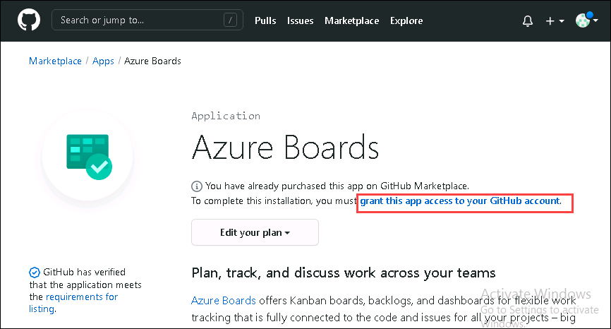
    
   - In the **Repository Access** section, Choose your repository and hit **Install and Authorize**. Once you have completed this you can skip to step 5.
    
     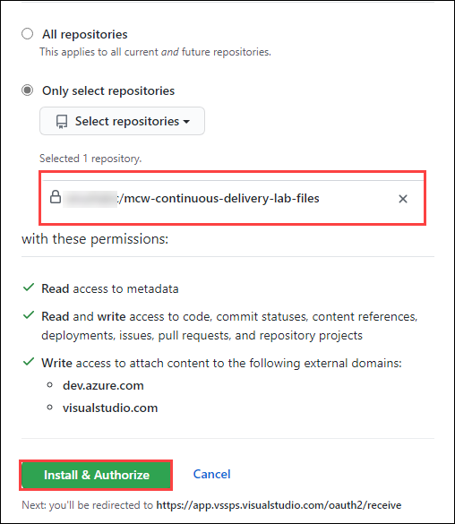
    
5. Select the **aiw-devops** Azure DevOps organization and select the Fabrikam project then click on **Continue**

    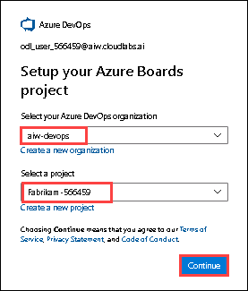

6. When the integration succeeds, you will be taken to the Azure DevOps Board. In the onboarding tutorial click on **Create** to create an initial Issue in the `To Do` Column.

    
    
7. Now click on **Create and link a pull request** to create a pull request associated with your Issue.

    

8. Open the new Issue that the onboarding tutorial creates and observe the GitHub pull request and comment that are linked to the Azure DevOps board Issue.

    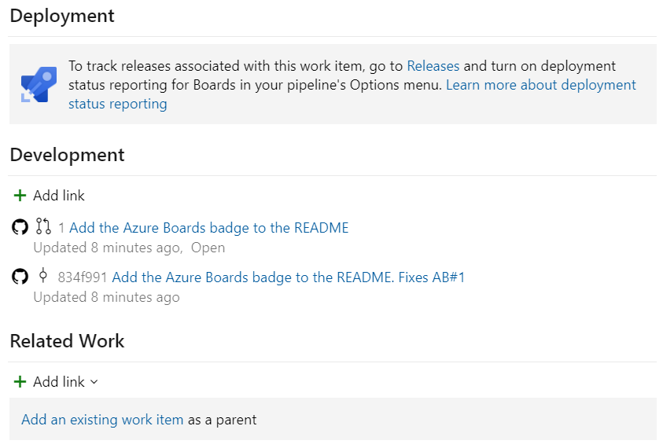

9. In GitHub, browse to the `Pull Requests` tab of the lab files repository created in [Task 1 of the Before the HOL Instructions] and open the pull request that was created in the onboarding tutorial for the Azure Boards Integration App. Note the `AB#1` annotation in the pull request comments - this annotation signals to Azure DevOps that this pull request comment should be linked to Issue #1 in Azure Boards.

    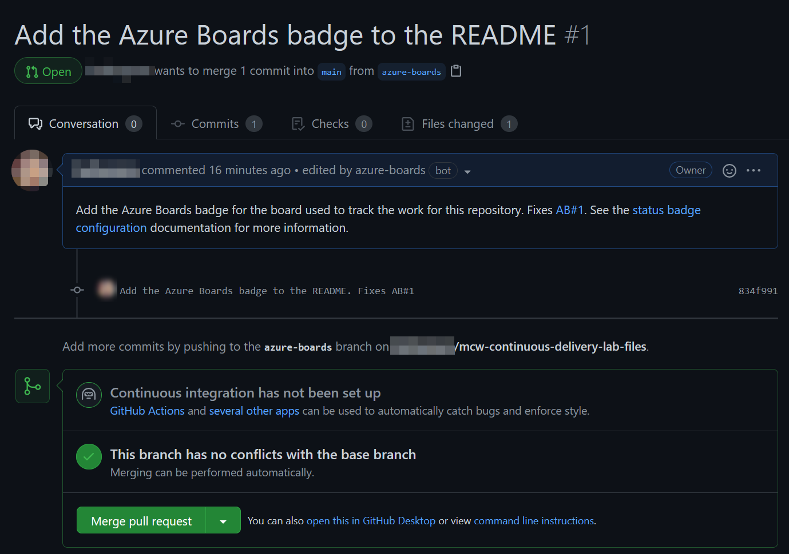

10. Select the `Files changed` tab within the pull request detail and observe the change to the README.md associated with this pull request. After reviewing the changes, go back to the `Conversation` tab and select the `Merge pull request` button and confirm the following prompt to merge the pull request into the `main` branch.

    

11. In Azure DevOps Boards, find the work item and observe that the issue has been moved to the `Done` column on completion of the pull request.

    

### Task 2: Using Dependabot

1. In your lab files GitHub repository, navigate to the `Security` tab.  Select the `Enable Dependabot alerts` button.

    

2. You should arrive at the `Security & analysis` blade under the `Settings` tab. Enable `Dependabot alerts` and `Dependabot security updates`.

    > **Note**: Enabling the `Dependabot alerts` will also automatically enable `Dependency graph`.

    

3. To observe Dependabot issues, navigate to the `Security` tab and select the `View Dependabot alerts` link. You should arrive at the `Dependabot alerts` blade in the `Security` tab.

    

4. Sort the Dependabot alerts by `Package name`. Locate the `handlebars` vulnerability by typing `handlebars` in the search box under the `Package` dropdown menu. 

    

5. Select any of the `handlebars` Dependabot alert entries to see the alert detail. After reviewing the alert, select `Create Dependabot security update` and wait a few moments for GitHub to create the security update.

    

    

6. In the `Pull Requests` tab, find the Dependabot security patch pull request and merge it to your main branch.

    

    

7. Pull the latest changes from your GitHub repository to your local GitHub folder.

    ```pwsh
    cd C:\Workspaces\lab\mcw-continuous-delivery-lab-files  # This path may vary depending on how
                                                            # you set up your lab files repository
    git pull
    ```

### Task 3: Set up Local Infrastructure

   > **Note**: Make sure the Docker Desktop is in Running state as shown in the below screenshot, If not close Docker Desktop from the Task Bar/Task Manager. Then Re-start Docker Desktop from Desktop and wait for 2-5 mins to Docker Desktop get Started.
   
   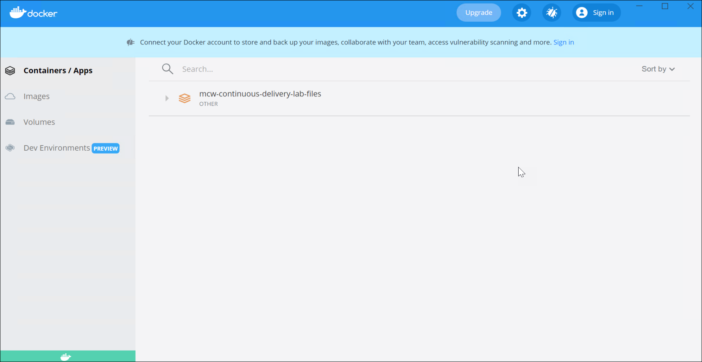

1. In your Labvm navigate to `C:\Workspaces\lab\mcw-continuous-delivery-lab-files` open **docker-compose.init.yml** and replace instances of `<yourgithubaccount>` with your GitHub account name.

    
    
1. Similarly in the same path open **docker-compose.yml** and replace instances of `<yourgithubaccount>` with your GitHub account name.

   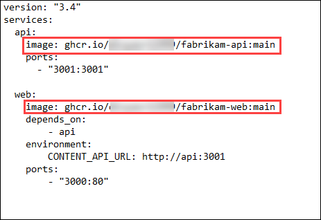

4. Now in PowerShell build and run the docker-compose YAML files edited in the previous step by running the following command. After 15-20 mins, proceed with the next step to check if you are able to see the website.

    ```pwsh
    docker-compose -f .\docker-compose.yml -f .\local.docker-compose.yml -f .\docker-compose.init.yml build
    docker-compose -f .\docker-compose.yml -f .\local.docker-compose.yml -f .\docker-compose.init.yml up
    ```
    
    > **Note**: If you face an issue while running the above command with respect to GitHub username, update username in lowercase letter and retry the command. 
    
    > If you face an issue while running above command with respect to default daemon configuration, open docker desktop and click on **Troubleshoot icon** at the right corner and select **Restart** to restart the docker desktop. It might take upto 5 minutes for restarting and rerun the command once restart is completed.
      
      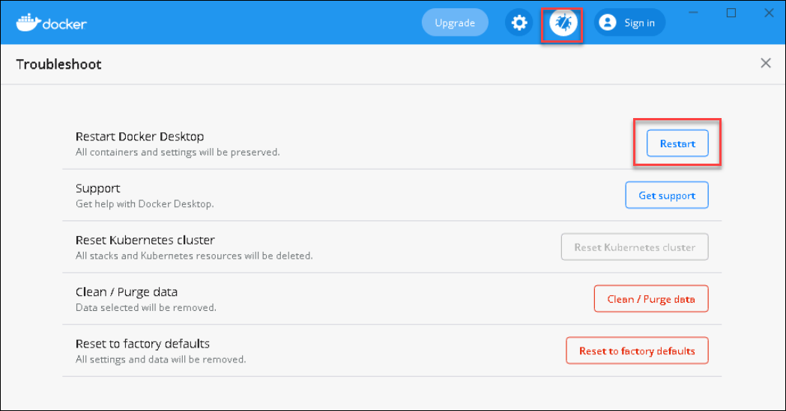
      
5. Verify that you can browse to http://localhost:3000 in a browser and arrive at the Fabrikam conference website.

   

   

6. Leave this PowerShell session in running and open a new session. Paste the following command and hit `<ENTER>`.

    ```pwsh
    cd C:\Workspaces\lab\mcw-continuous-delivery-lab-files
    ```

7. Commit and push your changes to your GitHub repository by running the following commands.

   ```
   git add .
   git commit -m "pushing changes"
   git push
   ```
   
 

### Task 4: Build Automation with GitHub Registry

1.  Now navigate back to your GitHub and select the **Settings(1)** tab from your lab files repository.

2. Select the **Secrets(2)** drop-down and select **Actions(3)** blade from the left navigation bar.

3. Select the **New repository secret(4)** button.

    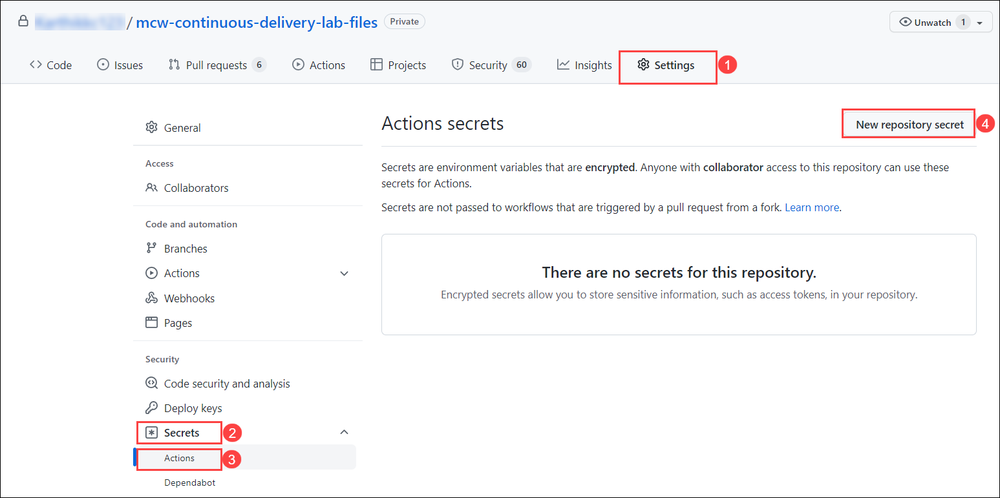

4. Enter the name **CR_PAT** in the **New secret** form and in **Value** set the GitHub Personal Access Token we created in the Before the Hands-On Lab instructions.

    

5. Select the `Actions` tab in your GitHub repository, under the **Continuous Integration Workflows** find the **Publish Docker Container** workflow and choose **Configure**.

    

6. Rename the file to `fabrikam-web.yml`.

7. Change the image name to `fabrikam-web` and the registry to `ghcr.io/${{ github.actor }}`. This is the name of the container image that will be pushed to the GitHub Container Registry.

    ```yaml
    env:
      # Use docker.io for Docker Hub if empty.
      REGISTRY: ghcr.io/${{ github.actor }}
      # github.repository as <account>/<repo>
      IMAGE_NAME: fabrikam-web
    ```
    
   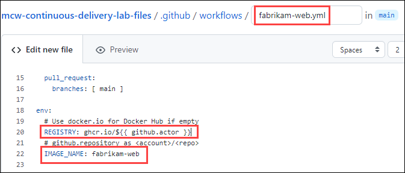

8. Add explicit path to `Dockerfile` and context path to the `Build and push Docker image` step. This step will ensure the correct `Dockerfile` file can be found.

    ```yaml
    # Build and push Docker image with Buildx (don't push on PR)
    # https://github.com/docker/build-push-action
    - name: Build and push Docker image
      id: build-and-push
      uses: docker/build-push-action@ad44023a93711e3deb337508980b4b5e9bcdc5dc
      with:
        file: ./content-web/Dockerfile                      # <-- Add these
        context: ./content-web                              # <-- two lines
        push: ${{ github.event_name != 'pull_request' }}
        tags: ${{ steps.meta.outputs.tags }}
        labels: ${{ steps.meta.outputs.labels }}
    ```
   
    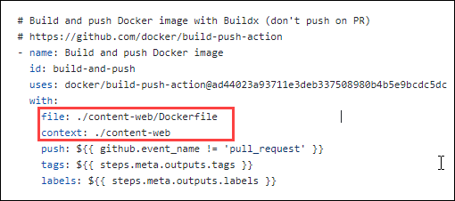
    

9. Commit the file to the repository by clicking on **Start commit (1)** and then **Commit new file (2)**.

    

10. The GitHub Action is now running and will automatically build and push the container to GitHub registry.

    

    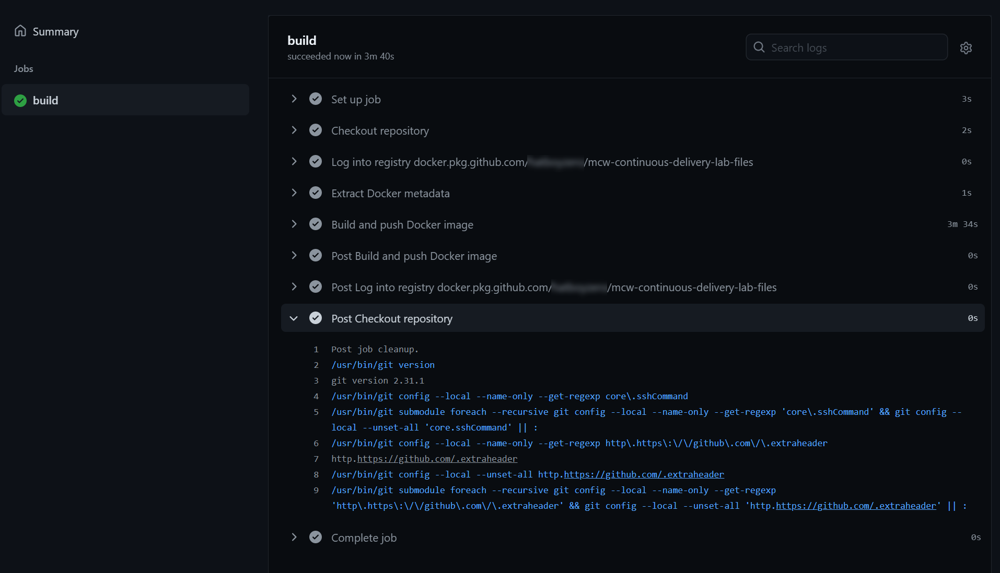
    
    > **Note :** If the build gets fail due to **Parsing reference**, update your github username with lowercase latter and re-run the workflow.

11. Now we will set up workflows for `content-api` and `content-init` in the same manner.

12. Select the **Actions** tab in your GitHub repository and click on **New Workflow**.

    

13. Scroll down to **Continuous Integration Workflows** find the **Publish Docker Container** workflow and choose **configure**.

    

14. Rename the file to `fabrikam-api.yml`.

15. Change the image name to `fabrikam-api` and the registry to `ghcr.io/${{ github.actor }}`. This is the name of the container image that will be pushed to the GitHub Container Registry.

    ```yaml
    env:
      # Use docker.io for Docker Hub if empty.
      REGISTRY: ghcr.io/${{ github.actor }}
      # github.repository as <account>/<repo>
      IMAGE_NAME: fabrikam-api
    ```
    
   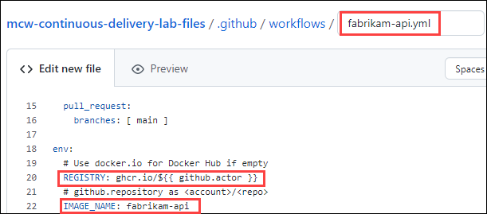

16. Add explicit path to `Dockerfile` and context path to the `Build and push Docker image` step. This step will ensure the correct `Dockerfile` file can be found.

    ```yaml
    # Build and push Docker image with Buildx (don't push on PR)
    # https://github.com/docker/build-push-action
    - name: Build and push Docker image
      id: build-and-push
      uses: docker/build-push-action@ad44023a93711e3deb337508980b4b5e9bcdc5dc
      with:
        file: ./content-api/Dockerfile                    # <-- Add these
        context: ./content-api                             # <-- two lines
        push: ${{ github.event_name != 'pull_request' }}
        tags: ${{ steps.meta.outputs.tags }}
        labels: ${{ steps.meta.outputs.labels }}
    ```
   
    
    

17. Commit the file to the repository by clicking on **Start commit (1)** and then **Commit new file (2)**.

    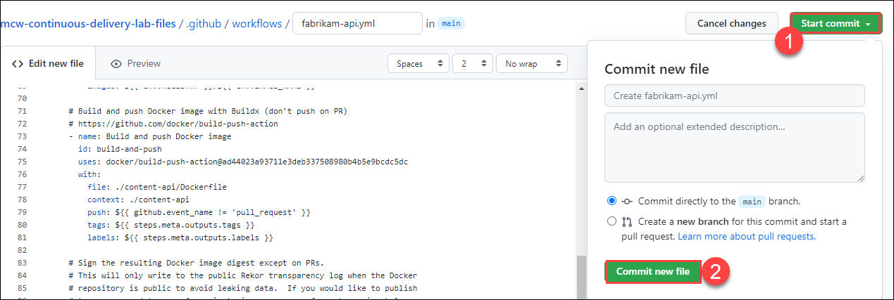


18. The GitHub Action is now running and will automatically build and push the container to GitHub registry.

    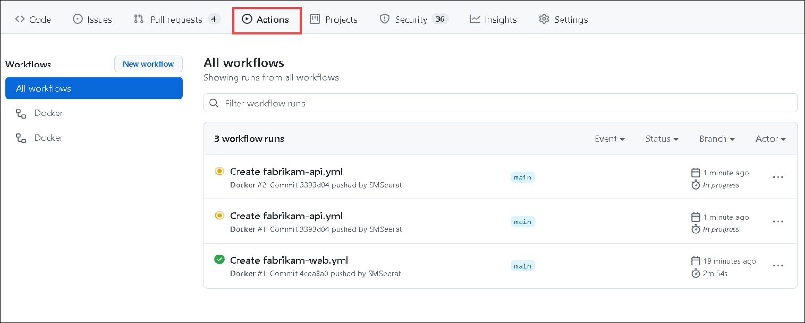

19. Again select the **Actions** tab in your GitHub repository and click on **New Workflow**.

    

20. Scroll down to **Continuous Integration Workflows** find the **Publish Docker Container** workflow and choose **configure**.

    

21. Rename the file to `fabrikam-init.yml`.

22. Change the image name to `fabrikam-init` and the registry to `ghcr.io/${{ github.actor }}`. This is the name of the container image that will be pushed to the GitHub Container Registry.

    ```yaml
    env:
      # Use docker.io for Docker Hub if empty.
      REGISTRY: ghcr.io/${{ github.actor }}
      # github.repository as <account>/<repo>
      IMAGE_NAME: fabrikam-init
    ```
    
    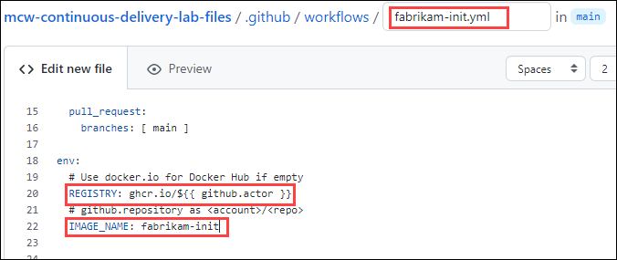

23. Add explicit path to `Dockerfile` and context path to the `Build and push Docker image` step. This step will ensure the correct `Dockerfile` file can be found.

    ```yaml
    # Build and push Docker image with Buildx (don't push on PR)
    # https://github.com/docker/build-push-action
    - name: Build and push Docker image
      id: build-and-push
      uses: docker/build-push-action@ad44023a93711e3deb337508980b4b5e9bcdc5dc
      with:
        file: ./content-init/Dockerfile                 # <-- Add these
        context: ./content-init                             # <-- two lines
        push: ${{ github.event_name != 'pull_request' }}
        tags: ${{ steps.meta.outputs.tags }}
        labels: ${{ steps.meta.outputs.labels }}
    ```
   
      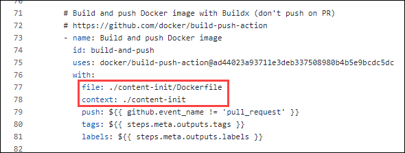
    

24. Commit the file to the repository by clicking on **Start commit (1)** and then **Commit new file (2)**.

    


25. The GitHub Action is now running and will automatically build and push the container to GitHub registry.

    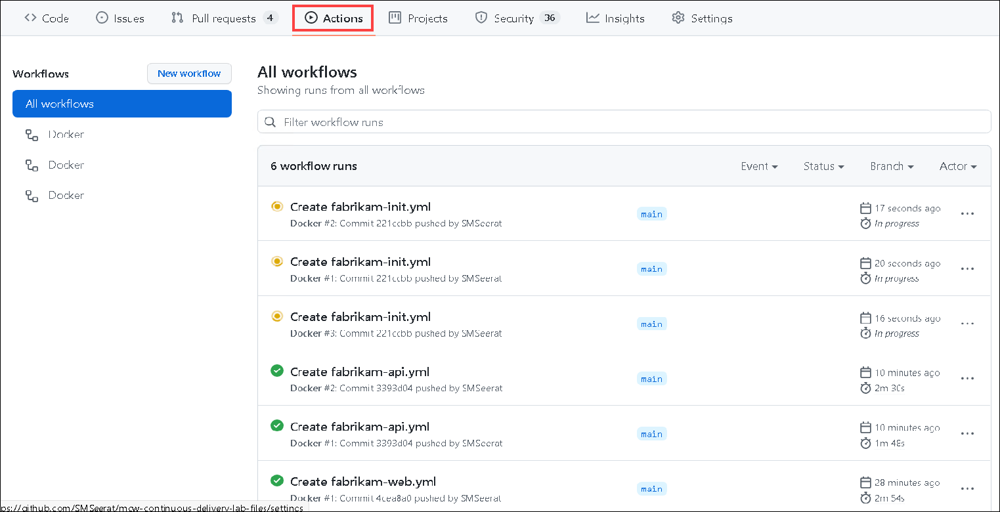

26. Click on your profile icon in the top right corner and select **Your repositories**. 

    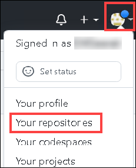

27. Navigate to the `Packages` and verify that the container images have been built and pushed to the container registry.

    

28. Pull the latest changes from your GitHub repository.

    ```
    git pull
    ```
    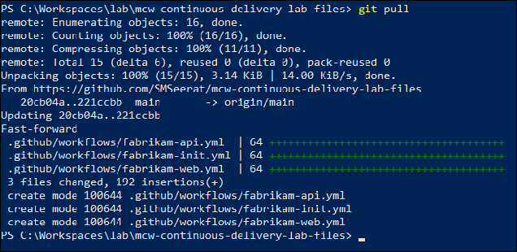

