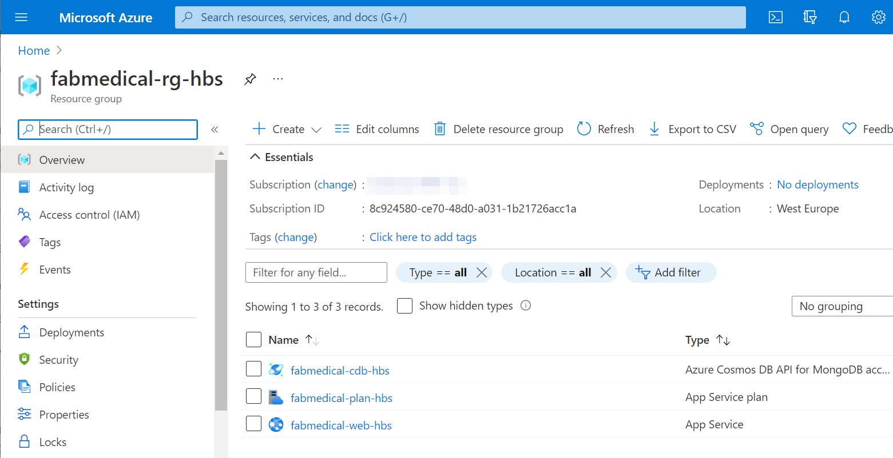
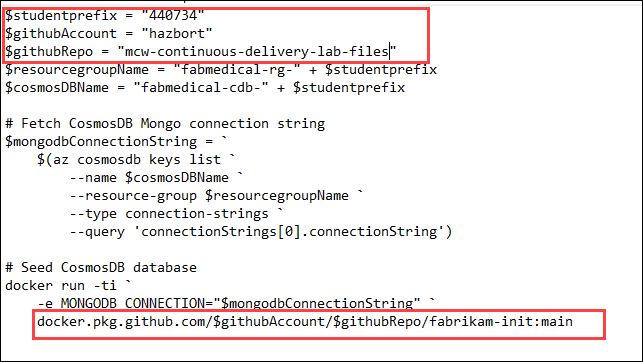

## Exercise 2: Continuous Delivery

Duration: 40 minutes

The Fabrikam Medical Conferences developer workflow has been improved. We are ready to consider migrating from running on-premises to a cloud implementation to reduce maintenance costs and facilitate scaling when necessary. We will take steps to run the containerized application in the cloud as well as automate its deployment.

### Task 1: Set up Cloud Infrastructure

1. In your Labvm open file explorer,  navigate to `C:\Workspaces\lab\mcw-continuous-delivery-lab-files\infrastructure` and open the `deploy-infrastructure.ps1` PowerShell script. In `deploy-infrastructure.ps1` replace studentprefix value with **<inject key="Deploymentid" />**.

    ```pswh
    $studentprefix = "hbs"                                  # <-- Modify this value
    $resourcegroupName = "fabmedical-rg-" + $studentprefix
    $cosmosDBName = "fabmedical-cdb-" + $studentprefix
    $webappName = "fabmedical-web-" + $studentprefix
    $planName = "fabmedical-plan-" + $studentprefix
    $location1 = "westeurope"
    $location2 = "northeurope"
    ```

2. Note the individual calls to the `azcli` for the following:
    - Creating a Resource Group

        ```pwsh
        # Create resource group
        az group create `
            --location $location1 `
            --name $resourcegroupName
        ```

    - Creating a CosmosDB Database

        ```pwsh
        # Create CosmosDB database
        az cosmosdb create `
            --name $cosmosDBName `
            --resource-group $resourcegroupName `
            --locations regionName=$location1 failoverPriority=0 isZoneRedundant=False `
            --locations regionName=$location2 failoverPriority=1 isZoneRedundant=True `
            --enable-multiple-write-locations `
            --kind MongoDB
        ```

    - Creating an Azure App Service Plan

        ```pwsh
        # Create Azure App Service Plan
        az appservice plan create `
            --name $planName `
            --resource-group $resourcegroupName `
            --sku S1 `
            --is-linux
        ```

    - Creating an Azure Web App

        ```pwsh
        # Create Azure Web App with NGINX container
        az webapp create `
            --resource-group $resourcegroupName `
            --plan $planName `
            --name $webappName `
            --deployment-container-image-name nginx
        ```

3. In your Powershell Terminal log in to Azure by running following command:

    ```pwsh
    az login
    ```

4. Run the `deploy-infrastructure.ps1` PowerShell script.

    ```pwsh
    cd ./infrastructure
    ./deploy-infrastructure.ps1
    ```
   
  >  **Note**: A resource group with name **fabmedical-rg-uniqueID** will be pre-created for you. If you see an authorization error you can ignore it and wait for the script execution to be completed.

5. Browse to the Azure Portal and verify creation of the resource group, CosmosDB instance, the App Service Plan, and the Web App.

    

6. Open the `seed-cosmosdb.ps1` PowerShell script in the `C:\Workspaces\lab\mcw-continuous-delivery-lab-files\infrastructure` folder of your lab files GitHub repository and replace `$studentprefix` variable value with **<inject key="Deploymentid" />**.  Also update the `$githubAccount` and `$githubRepo` variables with your GitHub account name, GitHub lab files repository name, respectively.

    ```pwsh
    $studentprefix = "hbs"
    $githubAccount = "hatboyzero"
    $githubRepo = "mcw-continuous-delivery-lab-files"
    $resourcegroupName = "fabmedical-rg-" + $studentprefix
    $cosmosDBName = "fabmedical-cdb-" + $studentprefix
    ```
    

7. Observe the call to fetch the MongoDB connection string for the CosmosDB database.

    ```pwsh
    # Fetch CosmosDB Mongo connection string
    $mongodbConnectionString = `
        $(az cosmosdb keys list `
            --name $cosmosDBName `
            --resource-group $resourcegroupName `
            --type connection-strings `
            --query 'connectionStrings[0].connectionString')
    ```

8. Note the call to seed the CosmosDB database using the MongoDB connection string passed as an environment variable (`MONGODB_CONNECTION`) to the `fabrikam-init` docker image we built in the previous exercise using `docker-compose`.

    ```pwsh
    # Seed CosmosDB database
    docker run -ti `
        -e MONGODB_CONNECTION="$mongodbConnectionString" `
        docker.pkg.github.com/$githubAccount/$githubRepo/fabrikam-init
    ```

    >**Note**: Before you pull this image, you may need to authenticate with the GitHub Docker registry. To do this, run the following command before you execute the script. Fill the placeholders appropriately.

    ```powershell
    docker login docker.pkg.github.com -u [USERNAME] -p [PERSONAL ACCESS TOKEN] 
    ```

9. Run the `seed-cosmosdb.ps1` PowerShell script. Browse to the Azure Portal and verify that the CosmosDB instance has been seeded.

    ```pwsh
    ./seed-cosmosdb.ps1
    ```

    

10. Below the `sessions` collection, select **Scale & Settings (1)** and **Indexing Policy (2)**.

    

11. Create a Single Field indexing policy for the `startTime` field (1). Then, select **Save** (2).

    

12. Open the `configure-webapp.ps1` PowerShell script in the `C:\Workspaces\lab\mcw-continuous-delivery-lab-files\infrastructure` folder of your lab files GitHub repository and replace `$studentprefix` variable value with **<inject key="Deploymentid" />** on the first line.

    ```pswh
    $studentprefix = "hbs"                                  # <-- Modify this value
    $resourcegroupName = "fabmedical-rg-" + $studentprefix
    $cosmosDBName = "fabmedical-cdb-" + $studentprefix
    ```

13. Observe the call to configure the Azure Web App using the MongoDB connection string passed as an environment variable (`MONGODB_CONNECTION`) to the web application.

    ```pwsh
    # Configure Web App
    az webapp config appsettings set `
        --name $webappName `
        --resource-group $resourcegroupName `
        --settings MONGODB_CONNECTION=$mongodbConnectionString
    ```

14. Run the `configure-webapp.ps1` PowerShell script. Browse to the Azure Portal and verify that the environment variable `MONGODB_CONNECTION` has been added to the Azure Web Application settings.

    ```pwsh
    ./configure-webapp.ps1
    ```

    

15. Take the GitHub Personal Access Token you obtained in the Before the Hands-On Lab guided instruction and assign it to the `GITHUB_TOKEN` environment variable in PowerShell. We will need this environment variable for the `deploy-webapp.ps1` PowerShell script, but we do not want to add it to any files that may get committed to the repository since it is a secret value.

    ```pwsh
    $env:GITHUB_TOKEN="<GitHub Personal Access Token>"
    ```

### Task 2: Deployment Automation to Azure Web App

1. Open the `deploy-webapp.ps1` PowerShell script in the `infrastructure` folder of your lab files GitHub repository and replace `$studentprefix` variable value with **<inject key="Deploymentid" />** on the first line and add your GitHub account name for the `$githubAccount` variable on the second line.

    ```pwsh
    $studentprefix = "hbs"                                  # <-- Modify this value
    $githubAccount = "hatboyzero"                           # <-- Modify this value
    $resourcegroupName = "fabmedical-rg-" + $studentprefix
    $webappName = "fabmedical-web-" + $studentprefix
    ```

2. Note the call to deploy the Azure Web Application using the `docker-compose.yml` file we modified in the previous exercise.

    ```pwsh
    # Deploy Azure Web App
    az webapp config container set `
        --docker-registry-server-password $env:GITHUB_TOKEN `
        --docker-registry-server-url https://docker.pkg.github.com `
        --docker-registry-server-user $githubAccount `
        --multicontainer-config-file ./../docker-compose.yml `
        --multicontainer-config-type COMPOSE `
        --name $webappName `
        --resource-group $resourcegroupName
    ```

3. Run the `deploy-webapp.ps1` PowerShell script.

     ```pwsh
    ./deploy-webapp.ps1
    ```

    > **Note**: Make sure to run the `deploy-webapp.ps1` script from the `infrastructure` folder

4. Browse to the Azure Portal and verify that the Azure Web Application is running by checking the `Log stream` blade of the Azure Web Application detail page.

    

5. Browse to the `Overview` blade of the Azure Web Application detail page and find the web application URL. Browse to that URL to verify deployment of the web application.

    

    

### (Optional) Task 3: Branch Policies in GitHub

 **Note:** This task is optional, and it can be performed only with GitHub Premium accounts.

1. In your lab files GitHub repository, navigate to the `Settings` tab and select the `Branches` blade.

    

2. Select the `Add rule` button to add a new branch protection rule for the `main` branch. Be sure to specify `main` in the branch name pattern field. Enable the following options and choose the `Create` button to create the branch protection rules:

        - Require pull request reviews before merging
        - Require status checks to pass before merging
            - Require branches to be up to date before merging

    

3. With the branch protection rule in place, direct commits and pushes to the `main` branch will be disabled. Verify this by making a small change to your README.md and attempt to commit it to `main` in your local repository and attempt to push it to the remote repository.

    ```pwsh
    PS D:\Workspaces\lab\mcw-continuous-delivery-lab-files> git add .

    PS D:\Workspaces\lab\mcw-continuous-delivery-lab-files> git commit -m "Updating README.md"

    [main cafa839] Updating README.md
    1 file changed, 2 insertions(+)
    PS D:\Workspaces\lab\mcw-continuous-delivery-lab-files> git push  

    Enumerating objects: 5, done.
    Counting objects: 100% (5/5), done.
    Delta compression using up to 32 threads
    Compressing objects: 100% (3/3), done.
    Writing objects: 100% (3/3), 315 bytes | 315.00 KiB/s, done.
    Total 3 (delta 2), reused 0 (delta 0), pack-reused 0
    remote: Resolving deltas: 100% (2/2), completed with 2 local objects.
    remote: error: GH006: Protected branch update failed for refs/heads/main.
    remote: error: At least 1 approving review is required by reviewers with write access.
    To https://github.com/hatboyzero/mcw-continuous-delivery-lab-files.git
    ! [remote rejected] main -> main (protected branch hook declined)
    error: failed to push some refs to 'https://github.com/hatboyzero/mcw-continuous-delivery-lab-files.git'
    ```

4. Create a new issue for modifying the README.md in Azure Boards

    

5. Create a branch from `main` and name it `feature/update-readme`.  Push the changes to the README.md to the remote repository.

    ```pwsh
    git checkout main
    git checkout -b feature/update-readme  # <- This creates the branch and checks it out
    git push --set-upstream origin feature/update-readme
    ```

    > **Note**: Because the changes had already been committed locally to the `main` branch in step 3, the changes already exist in the `feature/update-readme` branch - this is why we issue a `git push` immediately after branching from the local `main` branch.

6. Create a pull request to merge `feature/update-readme` into `main` in GitHub. Add the annotation `AB#2` in the description of the pull request to link it with the new Azure Boards issue in step 4.

    > **Note**: The `Docker` build workflow executes as part of the status checks.

7. Select the `Merge pull request` button after the build completes successfully to merge the Pull Request into `main`.

    

    > **Note**: Under normal circumstances, this pull request would be reviewed by someone other than the author of the pull request. For now, use your administrator privileges to force merge of the pull request.

8. Observe in Azure Boards the Issue is appropriately linked to the GitHub comment.

    
