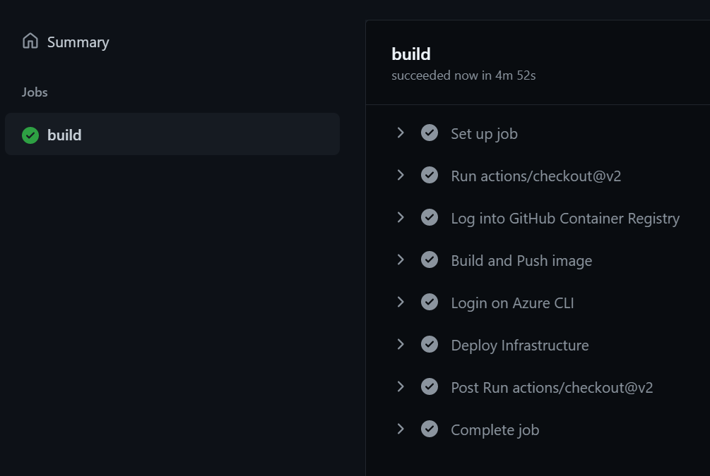
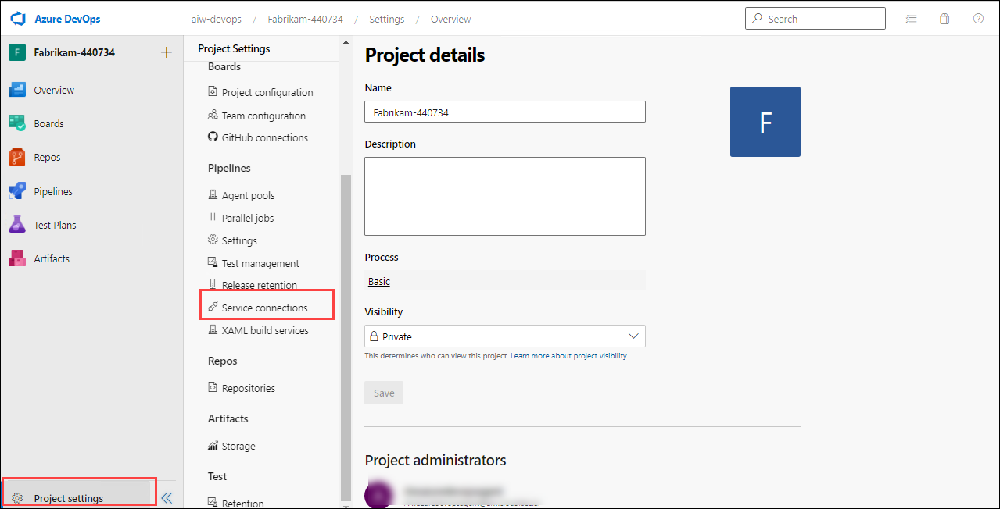
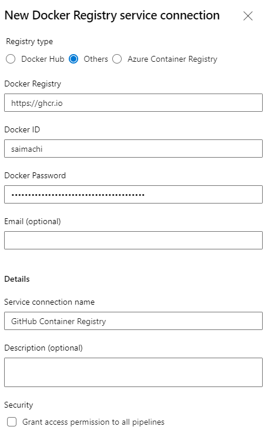
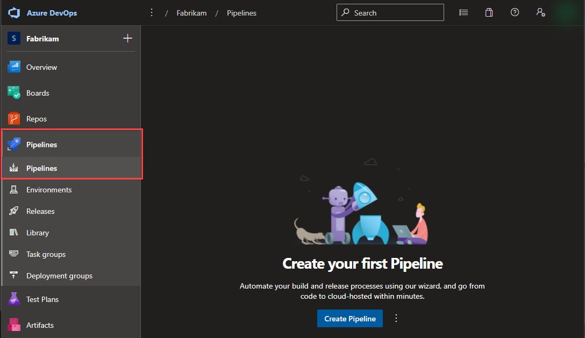
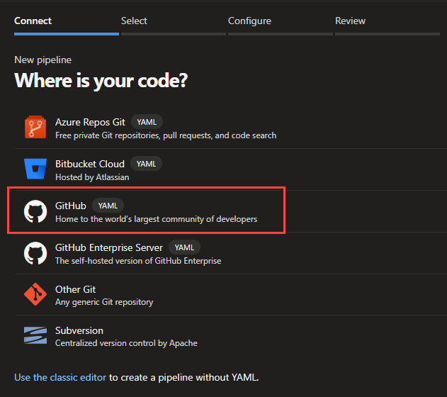
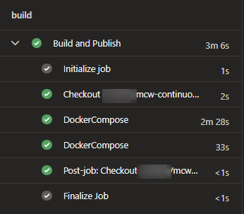
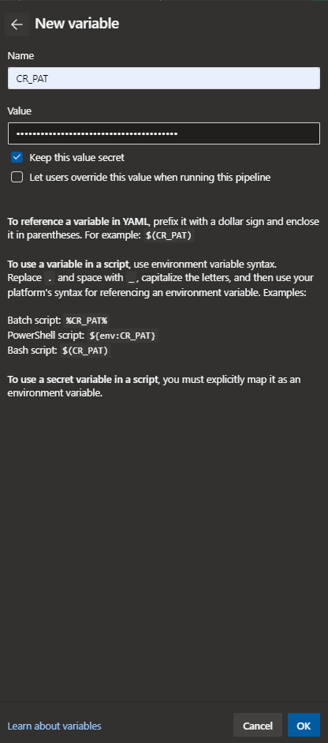

## Exercise 3: Monitoring and logging in Azure

Duration: 40 minutes

Fabrikam Medical Conferences has its first website for a customer running in the cloud, but deployment is still a largely manual process, and we have no insight into the behavior of the application in the cloud.

### Task 1: Set up Application Insights

1. Open the `deploy-appinsights.ps1` PowerShell script in the `C:\Workspaces\lab\mcw-continuous-delivery-lab-files\infrastructure` folder of your lab files GitHub repository and replace studentprefix value with **<inject key="Deploymentid" />** on the first line.

    ```pwsh
    $studentsuffix = "hbs"                                  # <-- Modify this
    $resourcegroupName = "fabmedical-rg-" + $studentsuffix
    $location1 = "westeurope"
    $appInsights = "fabmedicalai-" + $studentsuffix
    ```

2. Run the `deploy-appinsights.ps1` PowerShell script from a PowerShell terminal and save the `AI Instrumentation Key` specified in the output - we will need it for a later step.

    ```bash
    The installed extension 'application-insights' is in preview.
    AI Instrumentation Key="55cade0c-197e-4489-961c-51e2e6423ea2"
    ```

3. Navigate to the `./content-web` folder in your GitHub lab files repository and execute the following to install JavaScript support for Application Insights via NPM to the web application frontend.

    ```bash
    npm install applicationinsights --save
    ```

4. Modify the file `./content-web/app.js` to reflect the following to add and configure Application Insights for the web application frontend.

    ```js
    const express = require('express');
    const http = require('http');
    const path = require('path');
    const request = require('request');

    const app = express();

    const appInsights = require("applicationinsights");         # <-- Add these lines here
    appInsights.setup("55cade0c-197e-4489-961c-51e2e6423ea2");  # <-- Make sure AI Inst. Key matches
    appInsights.start();                                        # <-- key from step 2.

    app.use(express.static(path.join(__dirname, 'dist/content-web')));
    const contentApiUrl = process.env.CONTENT_API_URL || "http://localhost:3001";

    ...
    ```

5. Add and commit changes to your GitHub lab-files repository. From the root of the repository, execute the following:

    ```pwsh
    git add .
    git commit -m "Added Application Insights"
    git push
    ```

6. Wait for the GitHub Actions for your lab files repository to complete before executing the next step.

7. Redeploy the web application by running the `deploy-webapp.ps1` PowerShell script from the `infrastructure` folder.

8. Visit the deployed website and check Application Insights in the Azure Portal to see instrumentation data.

### Task 2: Continuous Deployment with GitHub Actions


 1. Go to Environment details click on **Service principle Credentials** copy **Application id(clientId)** , **clientSecret** , **subscriptionId** and **tenantId** 
    
    
    
    Replace the values that you copied in below Json

    ```pwsh
    {
        "clientId": "...",
        "clientSecret": "...",
        "subscriptionId": "...",
        "tenantId": "...",
        "activeDirectoryEndpointUrl": "https://login.microsoftonline.com",
        "resourceManagerEndpointUrl": "https://management.azure.com/",
        "activeDirectoryGraphResourceId": "https://graph.windows.net/",
        "sqlManagementEndpointUrl": "https://management.core.windows.net:8443/",
        "galleryEndpointUrl": "https://gallery.azure.com/",
        "managementEndpointUrl": "https://management.core.windows.net/"
    }
    ```
    Copy the complete JSON output to your clipboard.

3. In your GitHub lab files repository, navigate to the `Secrets` blade in the `Settings` tag and create a new repository secret named `AZURE_CREDENTIALS`. Paste the JSON output copied in the previous step to the secret value and save it.

4. Now we need to update the **deploy-webapp.ps1** file, to update navigate to infrastructure folder in your git repo and open it to edit the file. now update the **Student prefix** with **<inject key="Deploymentid" />** and **githubAccount** with your GitHub username.
 
      

5. Add a new GitHub Action workflow in your GitHub lab files repository by selecting the `Actions` tab and selecting `New workflow`. 

      

6. Select the `Simple workflow` and call the new YAML file `docker-publish.yml`.

7.  Remove all the content from the YAML and replace it with below content. Make sure to change the student prefix with **<inject key="Deploymentid" />** for the last action in the `build` job.

    ```yaml
    # This is a basic workflow to help you get started with Actions

    name: Docker Compose Build and Deploy

    env:
      REGISTRY: docker.pkg.github.com

    # Controls when the action will run. 
    on:
      # Triggers the workflow on push or pull request events but only for the main branch
      push:
        branches: [ main ]
      pull_request:
        branches: [ main ]

      # Allows you to run this workflow manually from the Actions tab
      workflow_dispatch:

    # A workflow run is made up of one or more jobs that can run sequentially or in parallel
    jobs:
      # This workflow contains a single job called "build"
      build:
        # The type of runner that the job will run on
        runs-on: ubuntu-latest

        # Steps represent a sequence of tasks that will be executed as part of the job
        steps:
        # Checks-out your repository under $GITHUB_WORKSPACE, so your job can access it
        - uses: actions/checkout@v2

        # Login against a Docker registry except on PR
        # https://github.com/docker/login-action
        - name: Log into registry ${{ env.REGISTRY }}
          if: github.event_name != 'pull_request'
          uses: docker/login-action@28218f9b04b4f3f62068d7b6ce6ca5b26e35336c
          with:
            registry: ${{ env.REGISTRY }}
            username: ${{ github.actor }}
            password: ${{ secrets.GITHUB_TOKEN }}

        - name: Build and Push image
          run: |
            docker-compose -f docker-compose.yml -f build.docker-compose.yml build
            docker-compose -f docker-compose.yml -f build.docker-compose.yml push

        - name: Login on Azure CLI
          uses: azure/login@v1.1
          with:
            creds: ${{ secrets.AZURE_CREDENTIALS }}

        - name: Deploy WebApp
          shell: pwsh
          env:
            GITHUB_TOKEN: ${{ secrets.GITHUB_TOKEN }}
          run: |
            cd ./infrastructure
            ./deploy-webapp.ps1 -studentprefix hbs  # <-- This needs to
                                                    # match the student
                                                    # prefix we use in
                                                    # previous steps.
    ```

8. Commit the YAML file to your `main` branch. A GitHub action should begin to execute for the new workflow.

    >**Note**: Make sure that your Actions workflow file does not contain any syntax errors, which may appear when you copy and paste. They are highlighted in the editor or when the Action tries to run, as shown below.

    

9. Observe that the action builds the docker images, pushes them to the container registry, and deploys them to the Azure web application.

    

10. Perform a `git pull` on your local repository folder to fetch the latest changes from GitHub.

### Task 3: Continuous Deployment with Azure DevOps Pipelines

> **Note**: This section demonstrates Continuous Deployment via ADO pipelines, which is equivalent to the Continuous Deployment via GitHub Actions demonstrated in Task 2. For this reason, disabling GitHub action here is critical so that both pipelines (ADO & GitHub Actions) don't interfere with each other.


1. In your GitHub navigate to `.github/workflows` directory, open `docker-publish.yml` and replace `branches: ...` with the following statement and then save the file.

    ```pwsh
    on:
      push:
        branches-ignore:    # <-- Add this list property
          - '**'            # <-- with '**' to disable all branches
    ```

2. Navigate to your Azure DevOps `Fabrikam` project, select the `Project Settings` blade, and open the `Service Connections` tab.

   

3. Create a new `Docker Registry` service connection and set the values to:

    - Docker Registry: `https://docker.pkg.github.com`
    - Docker ID: [GitHub account name]
    - Docker Password: [GitHub Personal Access Token]
    - Service connection name: GitHub Container Registry

    

4. Navigate to your Azure DevOps `Fabrikam` project, select the `Pipelines` blade, and create a new pipeline.

    

5. In the `Connect` tab, choose the `GitHub` selection.

    

6. Select your GitHub lab files repository.  Azure DevOps will redirect you to authorize yourself with GitHub. Log in and select the repository that you want to allow Azure DevOps to access.

7. In the `Configure` tab, choose the `Starter Pipeline`.

8. Remove all the steps from the YAML. The empty pipeline should look like the following:

    ```yaml
    # Starter pipeline
    # Start with a minimal pipeline that you can customize to build and deploy your code.
    # Add steps that build, run tests, deploy, and more:
    # https://aka.ms/yaml

    trigger:
    - main

    pool:
      vmImage: ubuntu-latest

    steps:
    ```

9. In the side bar, find the `Docker Compose` task and configure it with the following fields:

    - Container Registry Type: Container Registry
    - Docker Registry Service Connection: GitHub Container Registry (created in step 3)
    - Docker Compose File: **/docker-compose.yml
    - Additional Docker Compose Files: build.docker-compose.yml
    - Action: Build Service Images
    - Additional Image Tags = $(Build.BuildNumber)

    

10. Repeat step 9 and add another `Docker Compose` task and configure it with the following fields:

    - Container Registry Type: Container Registry
    - Docker Registry Service Connection: GitHub Container Registry (created in step 3)
    - Docker Compose File: **/docker-compose.yml
    - Additional Docker Compose Files: build.docker-compose.yml
    - Action: Push Service Images
    - Additional Image Tags = $(Build.BuildNumber)

11. Save and run the build. New docker images will be built and pushed to the GitHub package registry.

    

12. Navigate to your `Fabrikam` project in Azure DevOps and select the `Project Settings` blade. From there, select the `Service Connections` tab.

    
13. Create a new `Azure Resource Manager` service connection and choose `Service Principal (manual)`.

    


14. Enter your subscription ID, Name and get the Service Principal details from **Environment Details -> Service Prinicpal** details tab and then Service Connection name to **Fabrikam-Azure**. Value of Service Principal Id is the same as Application Id and Service Principal Key value is same as Secret key.
 
    >  **Note**: You can get subscription name from Azure portal -> Subscriptions

15. Open the build pipeline in `Edit` mode, and then select the `Variables` button on the top-right corner of the pipeline editor. 

    
    
    

16. Add a secret variable `CR_PAT`, check the `Keep this value secret` checkbox, and copy the GitHub Personal Access Token from the Before the Hands-on lab guided instruction into the `Value` field. Save the pipeline variable - we will reference it in a later step.

    

17. Modify the build pipeline YAML to split into a build stage and a deploy stage, as follows. Make sure to replace **arguments** value with **<inject key="Deploymentid" />**.
 

    ```yaml
    # Starter pipeline
    # Start with a minimal pipeline that you can customize to build and deploy your code.
    # Add steps that build, run tests, deploy, and more:
    # https://aka.ms/yaml

    trigger:
    - main

    pool:
      vmImage: ubuntu-latest

    stages:
    - stage: build
      jobs:
      - job: 'BuildAndPublish'
        displayName: 'Build and Publish'
        steps:
        - task: DockerCompose@0
          inputs:
            containerregistrytype: 'Container Registry'
            dockerRegistryEndpoint: 'GitHub Container Registry'
            dockerComposeFile: '**/docker-compose.yml'
            additionalDockerComposeFiles: 'build.docker-compose.yml'
            action: 'Build services'
            additionalImageTags: '$(Build.BuildNumber)'
        - task: DockerCompose@0
          inputs:
            containerregistrytype: 'Container Registry'
            dockerRegistryEndpoint: 'GitHub Container Registry'
            dockerComposeFile: '**/docker-compose.yml'
            additionalDockerComposeFiles: 'build.docker-compose.yml'
            action: 'Push services'
            additionalImageTags: '$(Build.BuildNumber)'    

    - stage: DeployProd
      dependsOn: build
      jobs:
      - deployment: webapp
        environment: production
        strategy:
          runOnce:
            deploy:
              steps:
              - checkout: self

              - powershell: |
                  (gc .\docker-compose.yml) `
                    -replace ':latest',':$(Build.BuildNumber)' | `
                    set-content .\docker-compose.yml
                    
              - task: AzureCLI@2
                inputs:
                  azureSubscription: 'Fabrikam-Azure' # <-- The service
                  scriptType: 'pscore'                # connection from step 14
                  scriptLocation: 'scriptPath'
                  scriptPath: './infrastructure/deploy-webapp.ps1'
                  workingDirectory: ./infrastructure
                  arguments: 'hbs'         # <-- This should be your custom
                env:                       # lowercase three character 
                  GITHUB_TOKEN: $(CR_PAT)  # prefix from an earlier exercise.
                                # ^^^^^^
                                # ||||||
                                # The pipeline variable from step 15
    ```

18. Navigate to the `Environments` category with the `Pipelines` blade in the `Fabrikam` project and select the `production` environment.

    

19. From the vertical ellipsis menu button in the top-right corner, select `Approvals and checks`.

    

20. Add an `Approvals` check.  Add your account as an `Approver` and create the check.

    

21. Run the build pipeline and note how the pipeline waits before moving to the `DeployProd` stage. You will need to approve the request before the `DeployProd` stage runs.

    
