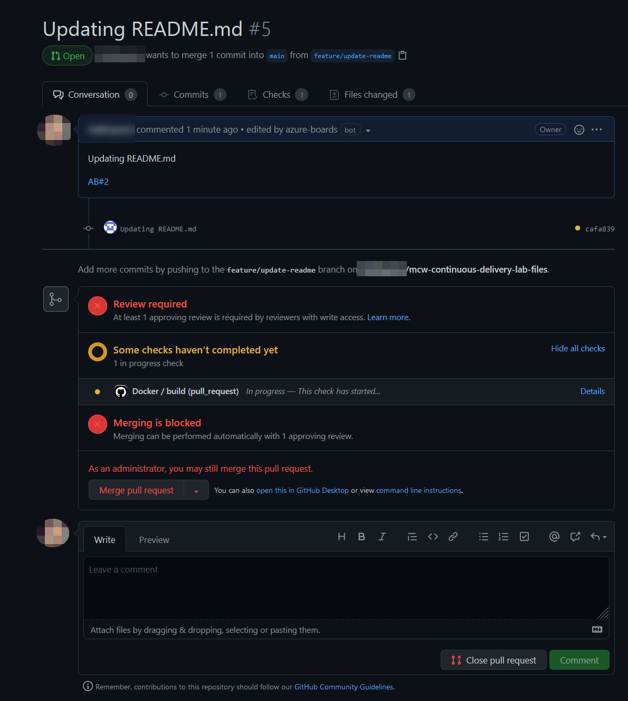
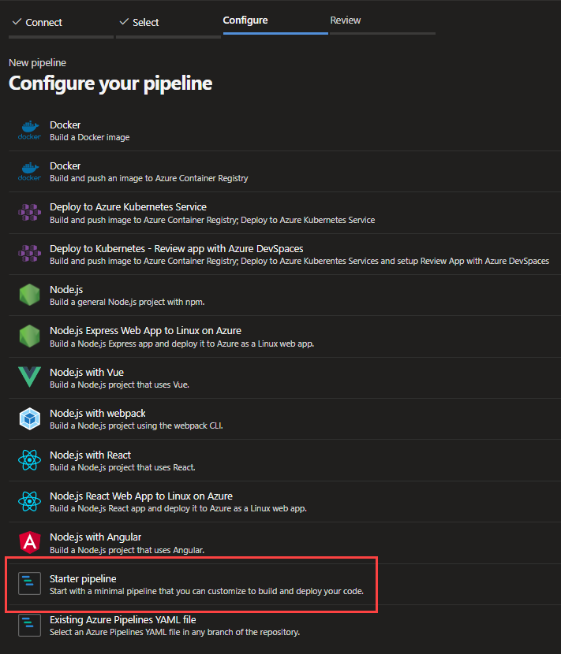
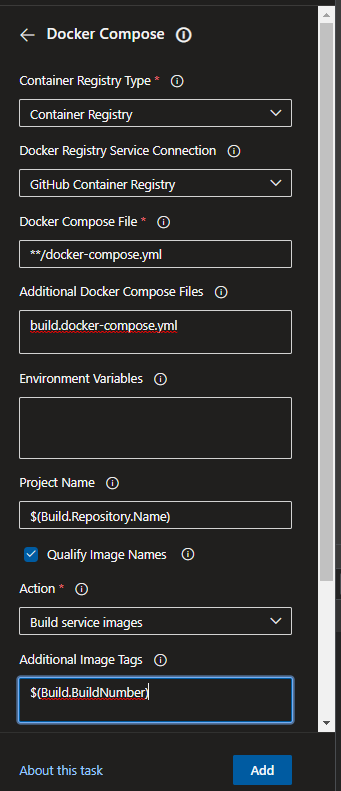
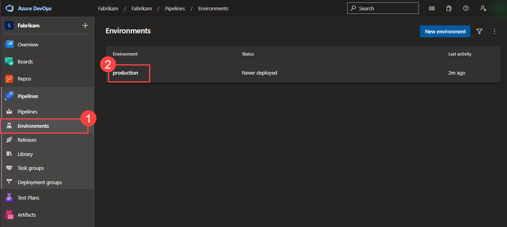
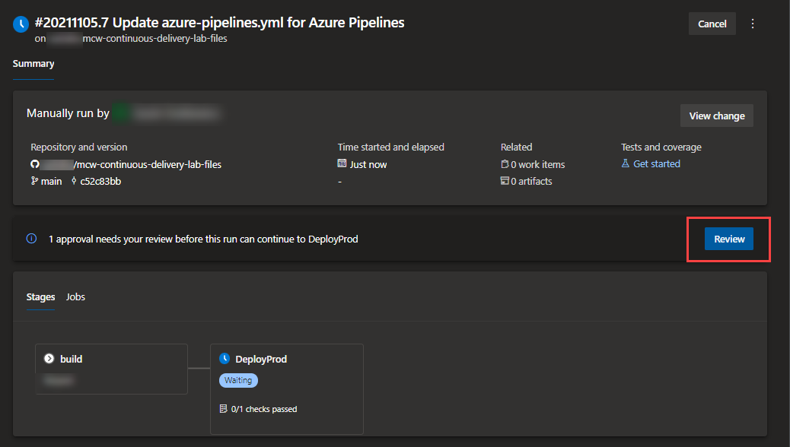

## Exercise 3: Monitoring, Logging, and Continuous Deployment with Azure

Duration: 40 minutes

Fabrikam Medical Conferences has its first website for a customer running in the cloud, but deployment is still a largely manual process, and we have no insight into the behavior of the application in the cloud. In this exercise, we will add monitoring and logging to gain insight on the application usage in the cloud. Then, we will disable the GitHub pipeline and show how to build a deployment pipeline in Azure DevOps.

### Task 1: Set up Application Insights

In this task, we will set up Application Insights to gain some insights on how our site is being used and assist in debugging if we run into issues.

1. Open the `deploy-appinsights.ps1` PowerShell script in the `infrastructure` folder of your lab files GitHub repository and add the same custom lowercase three-letter abbreviation we used in step 1 for the `$studentsuffix` variable on the first line.

    ```pwsh
    $studentsuffix = "Your 3 letter abbreviation here"
    $resourcegroupName = "fabmedical-rg-" + $studentsuffix
    $location1 = "westeurope"
    $appInsights = "fabmedicalai-" + $studentsuffix
    ```

2. Run the `deploy-appinsights.ps1` PowerShell script from a PowerShell terminal and save the `AI Instrumentation Key` specified in the output - we will need it for a later step.

    ```bash
    The installed extension 'application-insights' is in preview.
    AI Instrumentation Key="55cade0c-197e-4489-961c-51e2e6423ea2"
    ```

3. Navigate to the `./content-web` folder in your GitHub lab files repository and execute the following to install JavaScript support for Application Insights via NPM to the web application frontend.

    ```bash
    npm install applicationinsights --save
    ```

4. Modify the file `./content-web/app.js` to reflect the following to add and configure Application Insights for the web application frontend.

    ```js
    const express = require('express');
    const http = require('http');
    const path = require('path');
    const request = require('request');

    const app = express();

    const appInsights = require("applicationinsights");         # <-- Add these lines here
    appInsights.setup("55cade0c-197e-4489-961c-51e2e6423ea2");  # <-- Make sure AI Inst. Key matches
    appInsights.start();                                        # <-- key from step 2.

    app.use(express.static(path.join(__dirname, 'dist/content-web')));
    const contentApiUrl = process.env.CONTENT_API_URL || "http://localhost:3001";
    ```

5. Add and commit changes to your GitHub lab-files repository. From the root of the repository, execute the following:

    ```pwsh
    git add .
    git commit -m "Added Application Insights"
    git push
    ```

6. Wait for the GitHub Actions for your lab files repository to complete before executing the next step.

7. Redeploy the web application by running the `deploy-webapp.ps1` PowerShell script from the `infrastructure` folder.

8. Visit the deployed website and check Application Insights in [the Azure portal](https://portal.azure.com) to see instrumentation data.

### Task 2: Linking Git commits to Azure DevOps issues

In this task, you will create an issue in Azure DevOps and link a Git pull request from GitHub to the Azure DevOps issue. This uses the Azure Boards integration that was set up in the Before Hands on Lab.

1. Create a new issue for modifying the README.md in Azure Boards

    

    > **Note**: Make note of the issue number, as you will need it for a later step.

2. Create a branch from `main` and name it `feature/update-readme`.

    ```pwsh
    git checkout main
    git checkout -b feature/update-readme  # <- This creates the branch and checks it out    
    ```    

3. Make a small change to README.md. Commit the change, and push it to GitHub.

    ```pwsh
    git commit -m "README.md update"
    git push --set-upstream origin feature/update-readme
    ```

4. Create a pull request to merge `feature/update-readme` into `main` in GitHub. Add the annotation `AB#YOUR_ISSUE_NUMBER_FROM_STEP_4` in the description of the pull request to link the GitHub pull request with the new Azure Boards issue in step 4. For example, if your issue number is 2, then your annotation in the pull request description should include `AB#2`.

    > **Note**: The `Docker` build workflow executes as part of the status checks.

5. Select the `Merge pull request` button after the build completes successfully to merge the Pull Request into `main`.

    

    > **Note**: Under normal circumstances, this pull request would be reviewed by someone other than the author of the pull request. For now, use your administrator privileges to force the merge of the pull request.

6. Observe in Azure Boards that the Issue is appropriately linked to the GitHub comment.

    

### Task 3: Continuous Deployment with Azure DevOps Pipelines

> **Note**: This section demonstrates Continuous Deployment via ADO pipelines, which is equivalent to the Continuous Deployment via GitHub Actions demonstrated in Task 2. For this reason, disabling GitHub action here is critical so that both pipelines (ADO & GitHub Actions) don't interfere with each other.
> **Note**: To complete [Exercise 3: Task 3](#task-3-continuous-deployment-with-azure-devops-pipelines), the student will need to request a free grant of parallel jobs in Azure Pipelines via [this form](https://aka.ms/azpipelines-parallelism-request). More information can be found [here regarding changes in Azure Pipelines Grant for Public Projects](https://devblogs.microsoft.com/devops/change-in-azure-pipelines-grant-for-public-projects/)

1. Disable your GitHub Actions by adding the `branches-ignore` property to the existing workflows in your lab files repository (located under the `.github/workflows` folder).

    ```pwsh
    on:
      push:
        branches-ignore:    # <-- Add this list property
          - '**'            # <-- with '**' to disable all branches
    ```

2. Navigate to your Azure DevOps `Fabrikam` project, select the `Project Settings` blade, and open the `Service Connections` tab.

3. Create a new `Docker Registry` service connection and set the values to:

    - Docker Registry: <https://ghcr.io>
    - Docker ID: [GitHub account name]
    - Docker Password: [GitHub Personal Access Token]
    - Service connection name: GitHub Container Registry

    

4. Navigate to your Azure DevOps `Fabrikam` project, select the `Pipelines` blade, and create a new pipeline.

    

5. In the `Connect` tab, choose the `GitHub` selection.

    

6. Select your GitHub lab files repository. Azure DevOps will redirect you to authorize yourself with GitHub. Log in and select the repository that you want to allow Azure DevOps to access.

7. In the `Configure` tab, choose the `Starter Pipeline`.

    

8. Remove all the steps from the YAML. The empty pipeline should look like the following:

    ```yaml
    # Starter pipeline
    # Start with a minimal pipeline that you can customize to build and deploy your code.
    # Add steps that build, run tests, deploy, and more:
    # https://aka.ms/yaml

    trigger:
    - main

    pool:
      vmImage: ubuntu-latest

    steps:
    ```

9. In the sidebar, find the `Docker Compose` task and configure it with the following fields, then select the **Add** button:

    - Container Registry Type: Container Registry
    - Docker Registry Service Connection: GitHub Container Registry (created in step 3)
    - Docker Compose File: **/docker-compose.yml
    - Additional Docker Compose Files: build.docker-compose.yml
    - Action: Build Service Images
    - Additional Image Tags = $(Build.BuildNumber)

    
    

    >**Note**: If the sidebar doesn't appear, you may need to select `Show assistant`.

10. Repeat step 9 and add another `Docker Compose` task and configure it with the following fields:

    - Container Registry Type: Container Registry
    - Docker Registry Service Connection: GitHub Container Registry (created in step 3)
    - Docker Compose File: **/docker-compose.yml
    - Additional Docker Compose Files: build.docker-compose.yml
    - Action: Push Service Images
    - Additional Image Tags = $(Build.BuildNumber)

    >**Note**: Pay close attention to the **Action** in Step 10. This is where it differs from Step 9.

    The YAML should be:

    ```yaml
    # Starter pipeline
    # Start with a minimal pipeline that you can customize to build and deploy your code.
    # Add steps that build, run tests, deploy, and more:
    # https://aka.ms/yaml

    trigger:
    - main

    pool:
    vmImage: ubuntu-latest

    steps:
    - task: DockerCompose@0
    inputs:
        containerregistrytype: 'Container Registry'
        dockerRegistryEndpoint: 'GitHub Container Registry'
        dockerComposeFile: '**/docker-compose.yml'
        additionalDockerComposeFiles: 'build.docker-compose.yml'
        action: 'Push services'
        additionalImageTags: '$(Build.BuildNumber)'
    - task: DockerCompose@0
    inputs:
        containerregistrytype: 'Container Registry'
        dockerRegistryEndpoint: 'GitHub Container Registry'
        dockerComposeFile: '**/docker-compose.yml'
        additionalDockerComposeFiles: 'build.docker-compose.yml'
        action: 'Push services'
        additionalImageTags: '$(Build.BuildNumber)'
    ```

11. Save and run the build. New docker images will be built and pushed to the GitHub package registry.

    >**Note**: You may need to grant permission for the pipeline to use the service connection before the run happens.

    

    If you haven't been granted the parallelism, your job will fail with the following message:

    ```text
    ##[error]No hosted parallelism has been purchased or granted. To request a free parallelism grant, please fill out the following form https://aka.ms/azpipelines-parallelism-request
    ```

    Once parallelism is granted, then your pipeline can run.

12. Navigate to your `Fabrikam` project in Azure DevOps and select the `Project Settings` blade. From there, select the `Service Connections` tab.

13. Create a new `Azure Resource Manager` service connection and choose `Service Principal (automatic)`.

14. Choose your target subscription and resource group and set the `Service Connection` name to `Fabrikam-Azure`. Save the service connection - we will reference it in a later step.

15. Open the build pipeline in `Edit` mode, and then select the `Variables` button on the top-right corner of the pipeline editor. Add a secret variable `CR_PAT`, check the `Keep this value secret` checkbox, and copy the GitHub Personal Access Token from the Before the Hands-on lab guided instruction into the `Value` field. Save the pipeline variable - we will reference it in a later step.

    

16. Modify the build pipeline YAML to split into a build stage and a deploy stage, as follows.

    >**Note**: Pay close attention to the `DeployProd` stage, as you need to add your abbreviation to the `arguments` section.

    ```yaml
    # Starter pipeline
    # Start with a minimal pipeline that you can customize to build and deploy your code.
    # Add steps that build, run tests, deploy, and more:
    # https://aka.ms/yaml

    trigger:
    - main

    pool:
      vmImage: ubuntu-latest

    stages:
    - stage: build
      jobs:
      - job: 'BuildAndPublish'
        displayName: 'Build and Publish'
        steps:
        - task: DockerCompose@0
          inputs:
            containerregistrytype: 'Container Registry'
            dockerRegistryEndpoint: 'GitHub Container Registry'
            dockerComposeFile: '**/docker-compose.yml'
            additionalDockerComposeFiles: 'build.docker-compose.yml'
            action: 'Build services'
            additionalImageTags: '$(Build.BuildNumber)'
        - task: DockerCompose@0
          inputs:
            containerregistrytype: 'Container Registry'
            dockerRegistryEndpoint: 'GitHub Container Registry'
            dockerComposeFile: '**/docker-compose.yml'
            additionalDockerComposeFiles: 'build.docker-compose.yml'
            action: 'Push services'
            additionalImageTags: '$(Build.BuildNumber)'

    - stage: DeployProd
      dependsOn: build
      jobs:
      - deployment: webapp
        environment: production
        strategy:
          runOnce:
            deploy:
              steps:
              - checkout: self

              - powershell: |
                  (gc .\docker-compose.yml) `
                    -replace ':latest',':$(Build.BuildNumber)' | `
                    set-content .\docker-compose.yml
                    
              - task: AzureCLI@2
                inputs:
                  azureSubscription: 'Fabrikam-Azure' # <-- The service
                  scriptType: 'pscore'                # connection from step 14
                  scriptLocation: 'scriptPath'
                  scriptPath: './infrastructure/deploy-webapp.ps1'
                  workingDirectory: ./infrastructure
                  arguments: 'Your 3 letter abbreviation here'         # <-- This should be your custom
                env:                       # lowercase three character 
                  CR_PAT: $(CR_PAT)  # prefix from an earlier exercise.
                                # ^^^^^^
                                # ||||||
                                # The pipeline variable from step 15
    ```

17. Navigate to the `Environments` category with the `Pipelines` blade in the `Fabrikam` project and select the `production` environment.

    

18. From the vertical ellipsis menu button in the top-right corner, select `Approvals and checks`.

    

19. Add an `Approvals` check. Add your account as an `Approver` and create the check.

    

20. Run the build pipeline and note how the pipeline waits before moving to the `DeployProd` stage. You will need to approve the request before the `DeployProd` stage runs.

    
    
